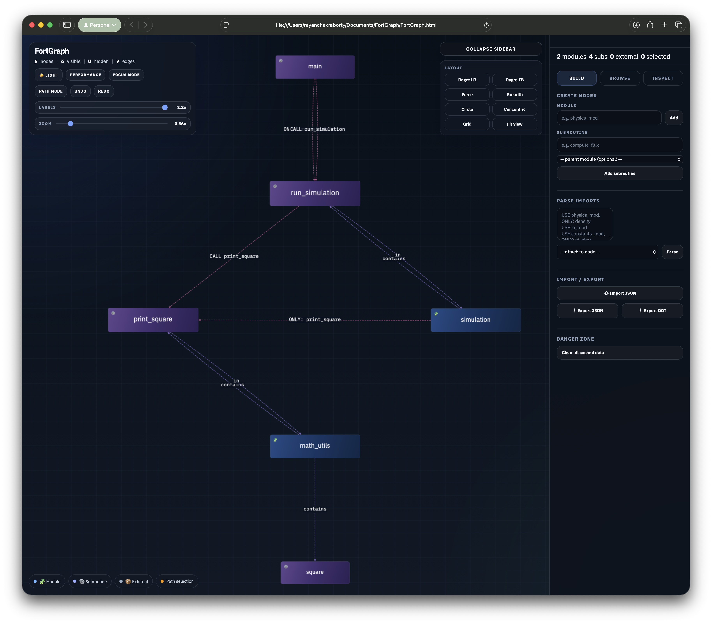
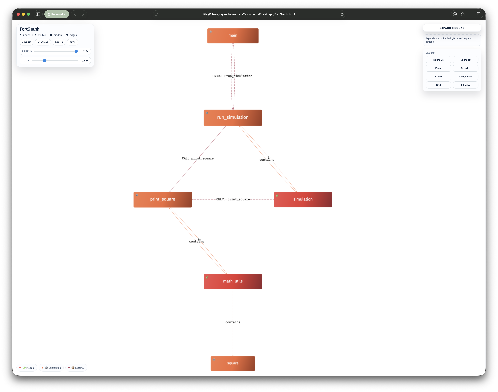
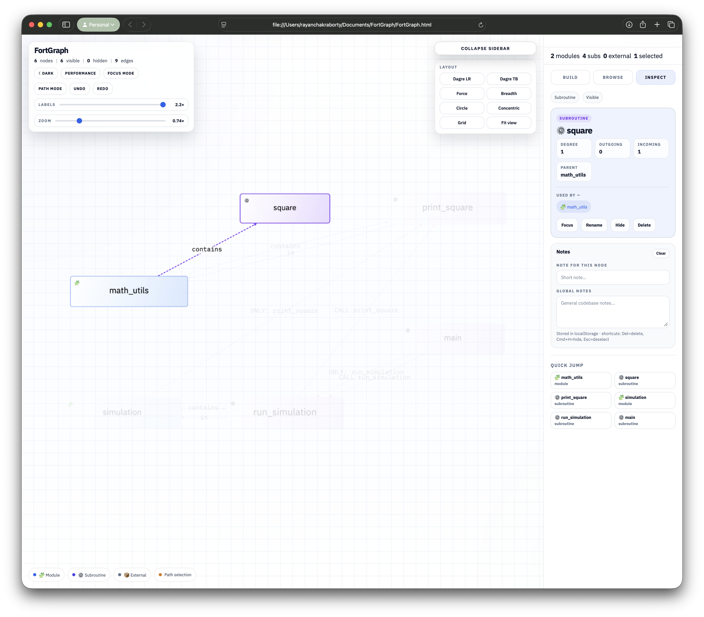
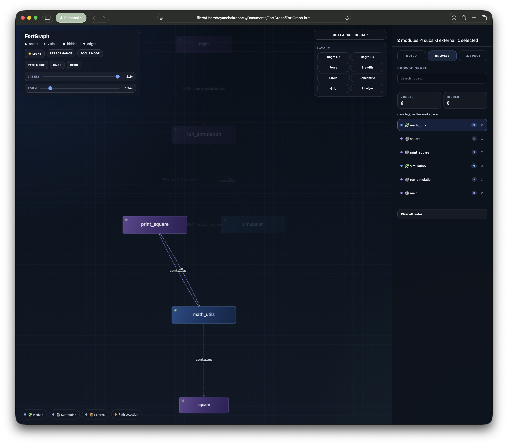
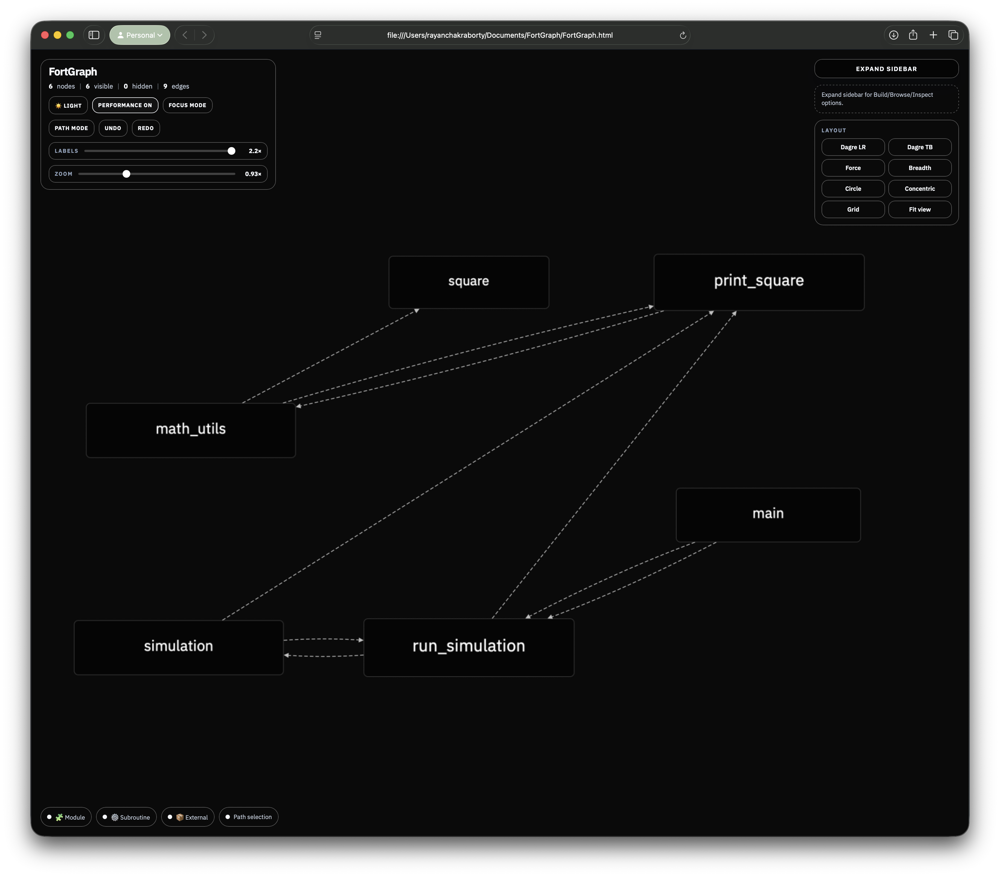
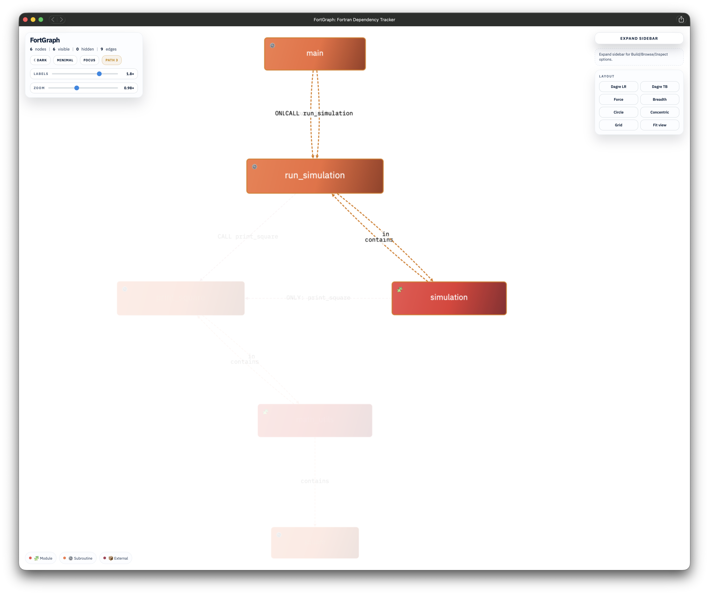
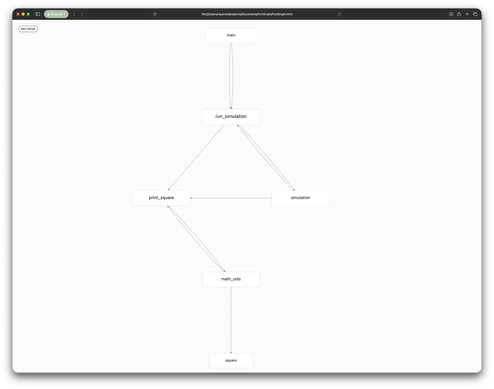

# [FortGraph](https://rayanc72.github.io/FortGraph/FortGraph.html)

FortGraph is a lightweight toolkit for generating and exploring dependency graphs for Fortran codebases. The project was created to address the limited availability of open-source tools for parsing, visualizing, and understanding the structure of Fortran software.

It consists of two independent components:

- Open `FortGraph.html` in a browser to get started with the interactive workspace (or use [this link](https://rayanc72.github.io/FortGraph/FortGraph.html) to access the online version).
- Optionally use `fortran_to_workflow.py` to parse Fortran source files and generate a JSON dependency graph that can be loaded into `FortGraph.html`.

The Python parser has no third-party dependencies, and the viewer does not require a backend server.

<p align="center">
  <a href="assets/light_theme_large.png">
    
  </a>
</p>


## Features

- Parses modern and common legacy Fortran source files.
- Recognizes modules, subroutines, functions, and programs.
- Detects:
  - module containment,
  - `USE` dependencies,
  - `USE ... ONLY:` dependencies,
  - direct `CALL` relationships,
  - optional inferred function calls.
- Represents unresolved modules and procedures as external nodes.
- Supports additive JSON import.
- Provides multiple graph layouts.
- Supports node search, hiding, notes, path highlighting, undo/redo, and JSON/DOT export.
- Parses pasted `USE` blocks in the viewer, including `USE ... ONLY:` statements, multiline continuations, and inline-comment stripping.
- Lets you resize the right sidebar to make long module and subroutine names easier to inspect.
- Shows detailed incoming and outgoing relationship labels in the **Inspect** tab, including `USE` and `ONLY:` edges in Minimal mode.
- Allows the Quick Jump list to be customized by adding or removing nodes while preserving the automatic default behavior.
- Includes an optional Performance mode for large graphs, with a simplified monochrome view and faster interaction.
- Runs locally so source code does not need to be uploaded to a remote service.

## Repository layout

```text
FortGraph/
├── FortGraph.html
├── fortran_to_workflow.py
├── README.md
├── assets
└── examples/
    └── basic/
        ├── README.md
        ├── sample_project.f90
        ├── sample_project.json
        └── fortgraph.schema.json
```
## Screenshots
click on the panels to zoom.
<table>
  <tr>
    <td align="center"><strong>Dark theme</strong></td>
    <td align="center"><strong>Light theme</strong></td>
  </tr>
  <tr>
    <td>
      <a href="assets/dark_theme.png">
      
    </td>
    <td>
      <a href="assets/light_theme.png">
      
    </td>
  </tr>
</table>

<table>
  <tr>
    <td align="center"><strong>Explore details and add notes</strong></td>
    <td align="center"><strong>Browse</strong></td>
  </tr>
  <tr>
    <td>
      <a href="assets/inspect_and_note.png">
      
    </td>
    <td>
      <a href="assets/browse.png">
      
    </td>
  </tr>
</table>

<table>
  <tr>
    <td align="center"><strong>Minimal display 1</strong></td>
    <td align="center"><strong>Minimal display 2</strong></td>
  </tr>
  <tr>
    <td>
      <a href="assets/minimal_dark.png">
      
    </td>
    <td>
      <a href="assets/light_minimal.png">
      
    </td>
  </tr>
</table>

<table>
  <tr>
    <td align="center"><strong>Highlight</strong></td>
    <td align="center"><strong>Focus mode</strong></td>
  </tr>
  <tr>
    <td>
      <a href="assets/highlight.png">
      
    </td>
    <td>
      <a href="assets/minimal_light_w_focus.png">
      
    </td>
  </tr>
</table>

## Requirements

### Python parser

- Python 3.10

### HTML viewer

- A modern desktop browser
- Internet access may be required if the HTML loads Cytoscape, Dagre, or fonts from external CDNs

## Quick start

### 1. Open the viewer

Open `FortGraph.html` in a browser. 

- The interface allows manual addition of modules and subroutines and graph export in JSON format. See the below section "Using the interactive viewer" for a more complete listing of its capabilities.

- For complex modules, you may want to use the following Python-based dependency generation workflow.

### 2. Generate a dependency graph

```bash
python3 fortran_to_workflow.py source.f90 -o dependencies.json
```

### 3. Import the JSON

In FortGraph:

1. Open the **Add** tab.
2. Locate the JSON import section.
3. Select `dependencies.json`.
4. Import it into the graph.

JSON imports are additive. Existing nodes and connections remain in place.

## Parser usage

```text
python3 fortran_to_workflow.py INPUT [INPUT ...] [OPTIONS]
```

### Parse one file

```bash
python3 fortran_to_workflow.py solver.f90 -o solver.json
```

### Parse multiple files

```bash
python3 fortran_to_workflow.py \
  constants.f90 \
  solver.f90 \
  main.f90 \
  -o project.json
```

Shell wildcards can also be used:

```bash
python3 fortran_to_workflow.py src/*.f90 -o project.json
```

### Parse a directory

```bash
python3 fortran_to_workflow.py src --recursive -o project.json
```

The short form is:

```bash
python3 fortran_to_workflow.py src -r -o project.json
```

### Include intrinsic modules

Intrinsic modules such as `iso_fortran_env` and `iso_c_binding` are omitted by default.

To include them:

```bash
python3 fortran_to_workflow.py src -r \
  --include-intrinsic-modules \
  -o project.json
```

### Infer function calls

Fortran expressions such as:

```fortran
energy = compute_energy(state)
```

may represent:

- a function call,
- an array reference,
- a type constructor.

FortGraph therefore does not infer these references by default.

To enable heuristic function-call detection:

```bash
python3 fortran_to_workflow.py src -r \
  --infer-functions \
  -o project.json
```

This option may produce false positives.

### Change JSON indentation

```bash
python3 fortran_to_workflow.py src -r \
  --indent 4 \
  -o project.json
```

## Supported source extensions

FortGraph recognizes the following common Fortran extensions:

```text
.f
.for
.ftn
.f77
.f90
.f95
.f03
.f08
.f18
```

Uppercase variants are also supported.

Files using `.f`, `.for`, `.ftn`, or `.f77` are treated as fixed-form Fortran. Other recognized extensions are treated as free-form Fortran.

## Graph model

FortGraph uses three node types.

| Node type | Meaning |
|---|---|
| `module` | A module defined in the parsed source |
| `subroutine` | A subroutine, function, or program defined in the parsed source |
| `external` | A referenced module or procedure not defined in the supplied files |

Functions and programs currently use the `subroutine` visual category so they can participate in the same procedure-dependency graph.

## Edge types

| Label or type | Meaning |
|---|---|
| `contains` | A module contains a procedure |
| `USE` | A scope imports a module |
| `ONLY: name` | A scope imports a named symbol |
| `CALL name` | A procedure directly calls another procedure |
| `FUNC name` | A likely function reference detected with `--infer-functions` |
| `in` | A symbol is associated with an imported module |

## JSON format

A FortGraph JSON file has the following top-level structure:

```json
{
  "version": 2,
  "nodes": [],
  "edges": []
}
```

### Node object

```json
{
  "id": "n-00001",
  "type": "module",
  "title": "math_utils",
  "parentId": null,
  "parentName": null,
  "position": {
    "x": 120,
    "y": 120
  }
}
```

Required node fields:

- `id`
- `type`
- `title`

Optional node fields:

- `parentId`
- `parentName`
- `position`

### Edge object

```json
{
  "id": "e-00001",
  "source": "n-00001",
  "target": "n-00002",
  "label": "contains",
  "type": "contains"
}
```

Required edge fields:

- `source`
- `target`

Recommended edge fields:

- `id`
- `label`
- `type`

The `source` and `target` values must reference valid node IDs.

A formal JSON Schema is provided in:

```text
examples/basic/fortgraph.schema.json
```

## Example

The `examples/basic` directory contains:

- `sample_project.f90` — a short Fortran example containing two modules and a program.
- `sample_project.json` — the corresponding FortGraph JSON graph.
- `fortgraph.schema.json` — a formal JSON Schema for FortGraph JSON files.

Generate the example yourself with:

```bash
python3 fortran_to_workflow.py \
  examples/basic/sample_project.f90 \
  -o examples/basic/sample_project.generated.json
```

Then open `FortGraph.html` and import the generated JSON.

## Using the interactive viewer

### Build tab

Use the **Build** tab to:

- add modules manually,
- add subroutines manually,
- parse pasted `USE` statements, including `USE ... ONLY:` imports,
- handle multiline `USE` statements with continuation markers and ignore inline `!` comments,
- import JSON,
- export JSON,
- export DOT,
- clear cached graph data.

### Browse tab

Use the **Browse** tab to:

- search nodes,
- select a node,
- hide or restore nodes,
- identify modules, procedures, and external references.

### Inspect tab

Use the **Inspect** tab to:

- inspect incoming and outgoing dependencies,
- view relationship labels such as `USE`, `ONLY: symbol`, and containment links even in Minimal mode,
- rename nodes,
- hide or delete nodes,
- add or remove the selected node from the Quick Jump list,
- reset a customized Quick Jump list back to the automatic default,
- add per-node notes,
- add global notes,
- enable focus mode.

### Sidebar sizing

On desktop, the right sidebar can be resized by dragging its left-edge handle. This is useful when working with long module or subroutine names that would otherwise wrap or truncate in the **Browse**, **Inspect**, or **Quick Jump** sections.

### Layouts

FortGraph supports several Cytoscape layouts:

- Dagre left-to-right
- Dagre top-to-bottom
- Force-directed
- Breadth-first
- Circle
- Concentric
- Grid

For graphs containing cycles, force-directed, circle, or concentric layouts may be easier to interpret than Dagre.

### Path selection

Path-selection mode lets you select several nodes and highlight edges between them.

### Local storage

The viewer stores the following data in browser local storage:

- graph state,
- node positions,
- notes,
- hidden nodes,
- theme,
- display settings.

Clearing browser storage or changing browser profiles will remove that state. Export the graph as JSON when you need a portable copy.

## Additive JSON import

Imported JSON is merged with the current graph.

FortGraph:

- preserves existing nodes and edges,
- matches nodes by case-insensitive title,
- adds previously unseen nodes,
- remaps imported edge endpoints,
- skips duplicate edges with the same source, target, and label,
- adjusts conflicting IDs,
- offsets imported positions to reduce overlap.

Because matching is case-insensitive, `solver_mod` and `SOLVER_MOD` are treated as the same node during import.

## Circular dependencies

The parser and viewer allow circular dependencies.

For example:

```text
procedure_a → procedure_b
procedure_b → procedure_a
```

Cycles are preserved in the JSON and displayed in the graph.

FortGraph does not currently:

- reject cycles,
- classify strongly connected components,
- specially color circular dependencies,
- issue cycle warnings.

## Parsing limitations

FortGraph uses a lightweight parser rather than a complete Fortran compiler frontend.

Known limitations include:

- Preprocessor branches are not evaluated.
- Generic interfaces may not resolve to a specific implementation.
- Procedure bindings may not resolve completely.
- Function-call inference is heuristic.
- Calls through procedure pointers may not resolve.
- Type-bound procedure calls may not resolve completely.
- Renamed imports are simplified to their remote symbol.
- Include files are not expanded automatically.
- Conditional compilation may produce inactive dependencies.
- Procedures with identical names in different scopes may be merged.

For compiler-grade semantic analysis, a full Fortran parser or compiler frontend would be required.


## Privacy

The Python parser runs locally.

The HTML viewer processes imported JSON locally in the browser and does not require a backend service.

## License

The code is distributed with open-source MIT license.

## Contributing

Issues and pull requests are welcome.
